# Annotation Panel — Features

A guide to what Annotation Panel does, the problems it addresses, and how to use it — written for annotators, reviewers, and project leads rather than developers.

For a browsable feature index with links into this document, see [FEATURES_OVERVIEW.md](./FEATURES_OVERVIEW.md). For JSON schema and format specifications, see [docs/export-format.md](docs/export-format.md) and [docs/label-configuration-import.md](docs/label-configuration-import.md).

---

## 1. Executive Summary

**Annotation Panel** is a 3D Slicer extension that unifies medical image annotation in a single, guided workflow. Instead of juggling separate Slicer tools for classification, region marking, and voxel segmentation, users configure labels once and annotate across three complementary modalities in one panel.

The extension serves teams who need structured, portable annotation data for:

- **AI and machine learning** — training data with consistent label schemas and multi-format segmentation export
- **Clinical and research review** — slice-level classification, ROI marking, and volumetric segmentation on CT, MRI, and other modalities
- **Dataset creation** — reproducible annotation packages that can be shared, imported, and resumed across sessions

Annotation Panel works **with or without a loaded scan**. Users can define label configurations and begin annotating immediately; when a volume appears in the Slicer scene (via DICOM import, drag-and-drop, or sample data), the panel links it automatically and enriches exports with series metadata.

The product follows a deliberate two-phase flow: **configure labels → annotate → export → import → continue editing**. Presets enforce configuration discipline so teams can standardize how studies are labeled before annotation begins.

---

## 2. Problems Solved

### Fragmented annotation tooling

In native 3D Slicer, classification, markups (ROI), and segmentation live in separate modules with different mental models. Annotation Panel consolidates all three into one workspace with shared label configuration, reducing context switching and training overhead.

### Inconsistent label schemas across projects

Without a central configuration step, label names, colors, and ROI tool assignments drift between annotators and sessions. The configuration screen and preset system establish a single source of truth for classification labels, ROI categories, and segmentation classes before any annotation begins.

### Poor annotation portability

Ad-hoc Slicer scene files are difficult to share, version, and feed into downstream pipelines. Annotation Panel exports self-contained packages (`annotations.json` plus optional segmentation volumes) with embedded label configuration and scan metadata, enabling handoff between annotators, reviewers, and ML engineers.

### No standardized team workflows

Research and clinical teams often need the same label set across dozens of cases. Presets can be saved, shared as JSON, and loaded from a dropdown — so a radiologist-defined spleen CT protocol, for example, can be reused without re-entering labels each session.

### Multi-modality annotation gaps

Many tools excel at one annotation type (bounding boxes *or* segmentation *or* slice labels) but not all three. Annotation Panel supports classification (whole-slice categories across anatomical planes), ROI (boxes, contours, measurements), and segmentation (voxel painting) in one session, with a single export that captures everything.

### Loss of context when resuming work

Import restores classification rows, ROI markups, segmentation masks, and label configuration — with explicit handling when imported configuration differs from the active session. Users can pick up where they left off or adopt an imported project's label schema.

---

## 3. Core Features

<h3 id="unified-annotation-workspace">1. Unified Annotation Workspace</h3>

**Description:** A single panel with three tabs — Classification, ROI, and Segmentation — sharing one label configuration and one export/import pipeline.

**User Value:** Annotators complete an entire case in one place without switching Slicer modules or reconciling label definitions manually.

**Typical Use Case:** A researcher labels a liver CT with slice-level "Normal/Abnormal" classification, draws a lesion bounding box, and paints a parenchyma segmentation — then exports one package for the ML team.

**Unified Annotation Workspace Screen:** The following screenshot shows the Annotation Panel’s central workspace, where the Classification, ROI, and Segmentation tabs are unified under a single labeling session.

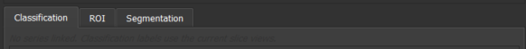

---

<h3 id="label-configuration-screen">2. Label Configuration Screen</h3>

**Description:** A dedicated first screen where users define three label categories: Classification Labels, ROI Categories (with per-category drawing tools), and Segment Labels. Labels include name, color, and description.

**User Value:** Forces intentional schema design before annotation begins, reducing rework and ensuring export consistency.

**Typical Use Case:** A project lead defines ROI categories each bound to the appropriate drawing tool.

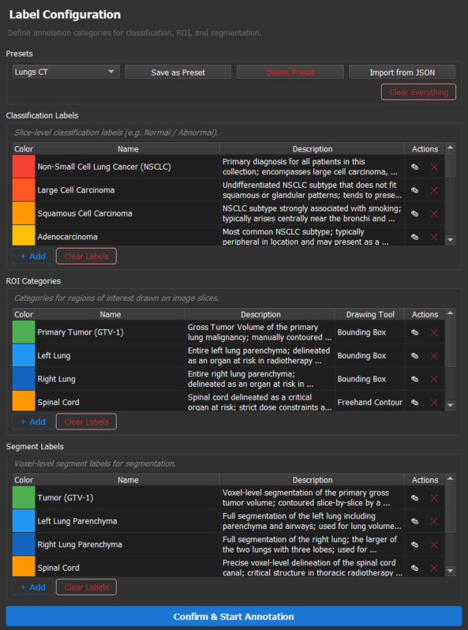

---

<h3 id="preset-management">3. Preset Management</h3>

**Description:** Save, load, delete, and import label configurations as named presets stored on disk. Unmodified loaded presets allow immediate continuation; manual or imported configs must be saved before annotating.

**User Value:** Teams share standardized label protocols; individual annotators skip repetitive setup.

**Typical Use Case:** A "Spleen CT Annotation" preset (classification: Normal/Enlarged/Abnormal; ROI: Spleen polygon, Lesion bounding box; segments: Spleen/Lesion/Infarct) is distributed as JSON and loaded by every annotator on the project.

**Preset Save Screen:** This screenshot shows the Annotation Panel interface for saving a new preset configuration.

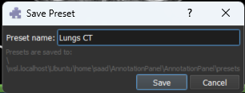

**Preset Update Workflow:** This screenshot illustrates the interface for updating a saved preset configuration.

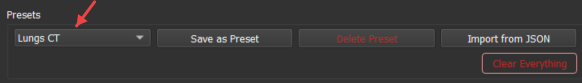

**Preset Delete Screen:** This screenshot shows the Annotation Panel interface for deleting a saved preset configuration.

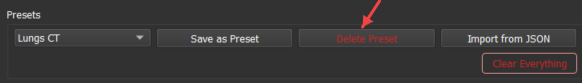

**Preset Import Screen:** This screenshot displays the Annotation Panel interface for importing a label configuration preset from disk.

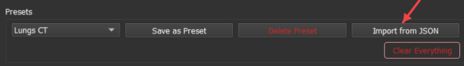

**Preset Selection Screen:** This screenshot demonstrates the Annotation Panel interface for selecting and loading a previously saved preset configuration to begin annotation.

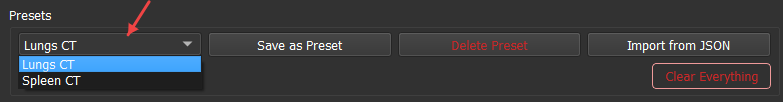

---

<h3 id="classification-annotation">4. Classification Annotation</h3>

**Description:** Assign slice-level classification labels by capturing Axial, Coronal, and Sagittal slice positions simultaneously when the user clicks Add.

**User Value:** Records spatial context across all standard planes in one action — richer than a single-plane label and useful for review and downstream analysis.

**Typical Use Case:** A radiologist marks a slice as "Enlarged" spleen while the panel records exact slice indexes and physical offsets in all three orientations.

**Classification Annotation Screen:** This screenshot demonstrates the interface for assigning a classification label to a slice, capturing Axial, Coronal, and Sagittal positions with a single action.

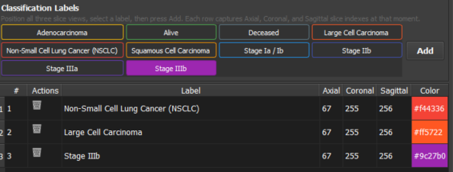

---

<h3 id="roi-annotation">5. ROI Annotation</h3>

**Description:** Draw regions of interest using Slicer Markups: 2D bounding box, 3D bounding box, polygon contour, freehand contour, and linear measurement. Each ROI category is pre-bound to a drawing tool in configuration.

**User Value:** Supports diverse clinical marking needs — organ boundaries, lesion boxes, distance measurements — with category-specific tooling.

**Typical Use Case:** A researcher draws a polygon around spleen parenchyma, a 3D box around a focal lesion, and a line across an imaging artifact.

**ROI Annotation Screen:** This screenshot demonstrates the interface for drawing a region of interest using the panel's drawing tools. As shown in the image, only the Bounding Box 2D tool is available for the label "Splenic Hilar Lymph Node".

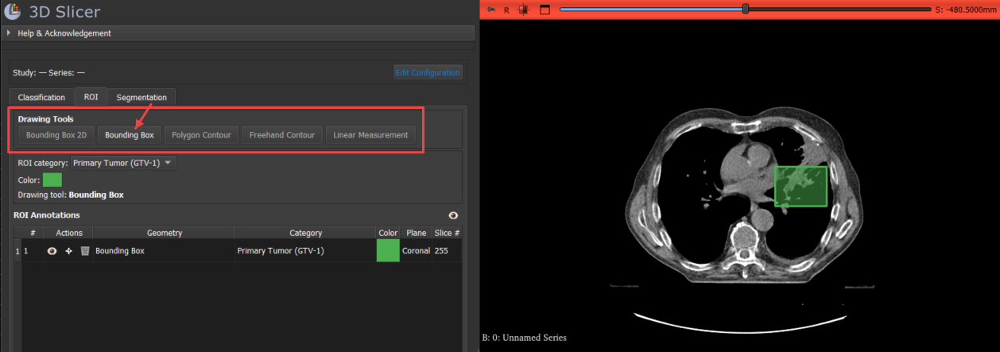

---

<h3 id="roi-session-management">6. ROI Session Management</h3>

**Description:** Per-ROI visibility toggles, global hide/show all, move/rotate transform handles, extend mode for adding points to existing contours, table row selection that jumps slice views to the ROI, and per-ROI deletion.

**User Value:** Annotators manage complex multi-ROI cases without cluttering the view or losing spatial context.

**Typical Use Case:** During review, an annotator hides all ROIs except the lesion box, then clicks a table row to navigate directly to that region.

**ROI Hide Example:** This screenshot shows the Annotation Panel after locally hiding one ROI region while other ROIs remain visible. The red arrow shows the hide icon.

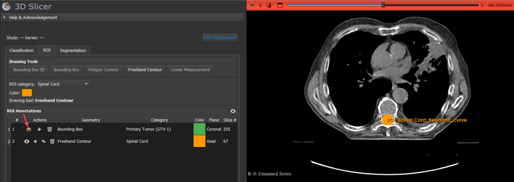

**ROI Hide All Example:** This screenshot illustrates the use of the global hide icon to temporarily hide all ROIs at once from the view for focused analysis.

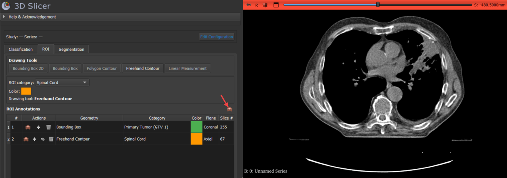

**ROI Move Example:** The following screenshot highlights the move toggle button (shown by the arrow). Enabling this toggle activates the move/rotate tool, allowing the user to reposition or rotate a specific ROI, which is updated and visible across all image planes.

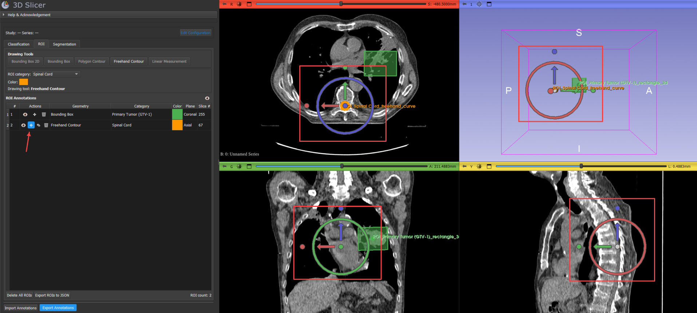

**ROI Extend Example:** The screenshot below highlights the extend button, indicated by the left arrow. When the user clicks this button, the panel enters "extend mode": any new points added will extend the currently selected ROI until the annotation is ended with a right click.

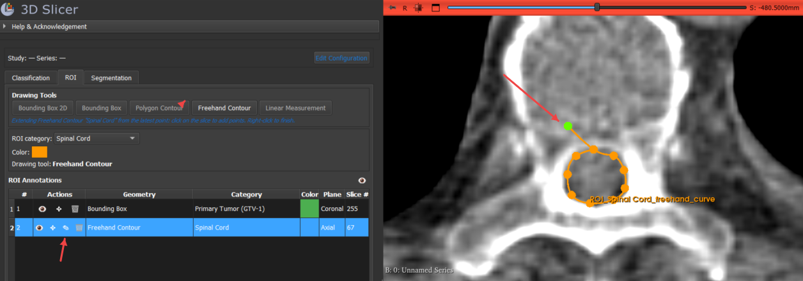

**ROI Table Jump Example:** By clicking on the desired ROI from the table on the left, the slice views on all planes automatically jump to focus on that ROI, streamlining navigation across multiple orientations.

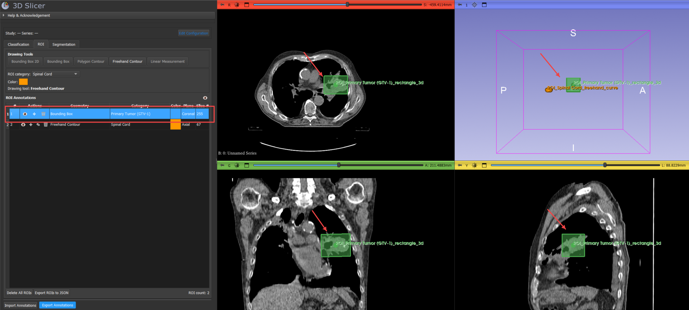

---

<h3 id="segmentation-annotation">7. Segmentation Annotation</h3>

**Description:** Embedded 3D Slicer Segment Editor with a curated set of 14 effects (Threshold, Paint, Draw, Erase, Level tracing, Grow from seeds, Fill between slices, Margin, Hollow, Smoothing, Scissors, Islands, Logical operators, Mask volume). Overlay opacity is adjustable.

**User Value:** Full voxel-level segmentation power within the unified panel, without navigating Slicer's standalone Segment Editor module.

**Typical Use Case:** An annotator thresholds spleen parenchyma, paints missed regions, and uses Fill between slices to interpolate across sparse axial slices.

**Segmentation Threshold Example:** In this screenshot, the threshold range for segmentation is visible within the red box and highlighted region across all three planes, each overlaid with the corresponding label color. This visual feedback lets annotators verify the exact voxels included by the chosen threshold, supporting precise segmentation workflows.

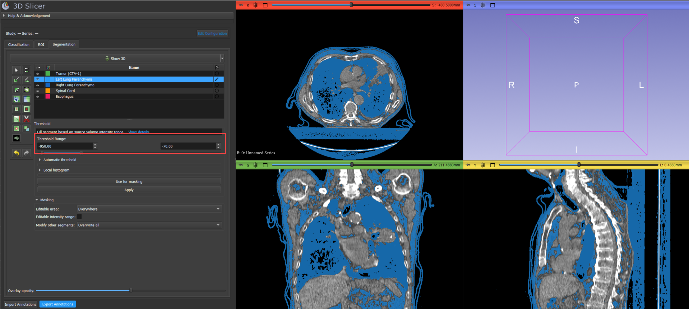

**Segmentation Paint Example:** In this screenshot, the paint tool is used to highlight the annotated region across all three orthogonal planes simultaneously. The colored overlay shows exactly which voxels have been labeled by painting, giving instant multi-planar visual feedback and supporting precise segmentation across the entire volume.

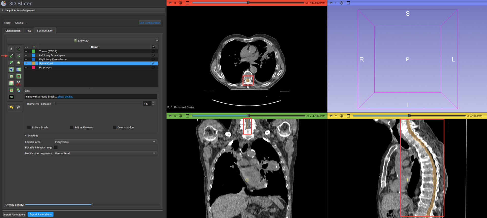

---

<h3 id="volume-optional-annotation">8. Volume-Optional Annotation</h3>

**Description:** Classification, ROI, and segmentation can operate without a loaded image series. Segmentation initializes with default reference geometry when no volume is present; classification uses current slice views.

**User Value:** Teams can configure labels, test workflows, and begin annotation setup before imaging data arrives.

**Typical Use Case:** A project manager defines and saves presets while waiting for DICOM transfer; annotators load the scan later and the panel links automatically.

**Volume-Optional ROI Drawing Example:** The screenshot below shows ROI regions being drawn in the Annotation Panel when no scan is loaded. This allows users to define regions of interest based on panel coordinates or reference geometry, enabling workflow setup before imaging data is available.

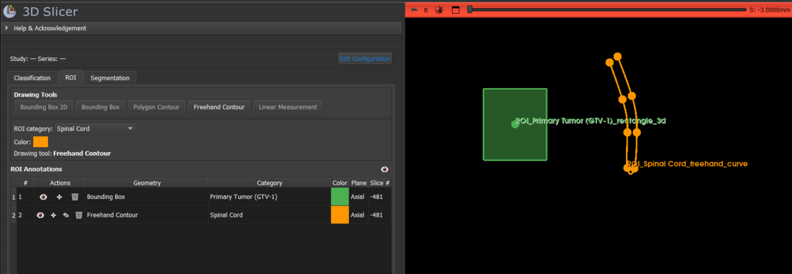

---

<h3 id="automatic-volume-linking">9. Automatic Volume Linking</h3>

**Description:** When a volume appears in the Slicer scene, the panel detects it and binds scan metadata (DICOM UIDs, spacing, IJK→RAS matrix, window/level) for export — without a series picker in the panel UI.

**User Value:** Zero-friction connection between loaded imaging data and annotation exports.

**Typical Use Case:** A user drags an NRRD file into Slicer; the panel immediately shows study/series context and includes full metadata in the next export.

**Automatic Volume Linking Example:** The screenshot below shows previously drawn ROIs (before a scan was loaded) automatically appearing over the newly loaded scan at the correct position and slice. This demonstrates how the panel seamlessly links and overlays ROIs onto imaging data as soon as the scan is available.

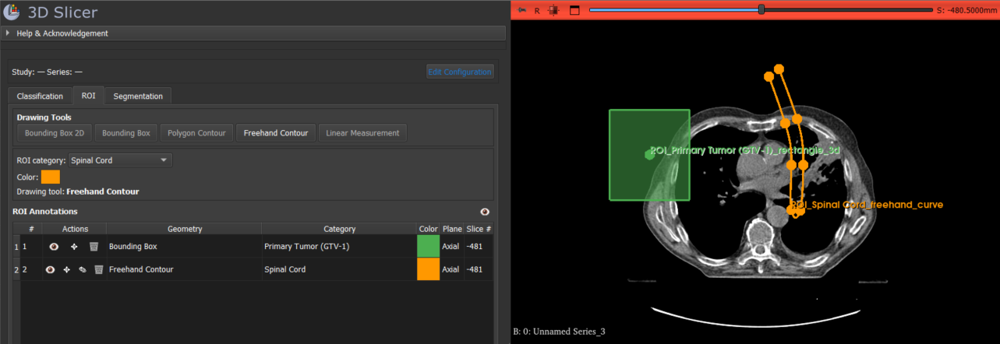

**Automatic Volume Linking Export Example:** The screenshot below shows ROI, segmentation overlays, and metadata (e.g., in the DICOM UID field) reflected in the next export. When a scan becomes available, all previously created annotations are positioned and included automatically in the output dataset.

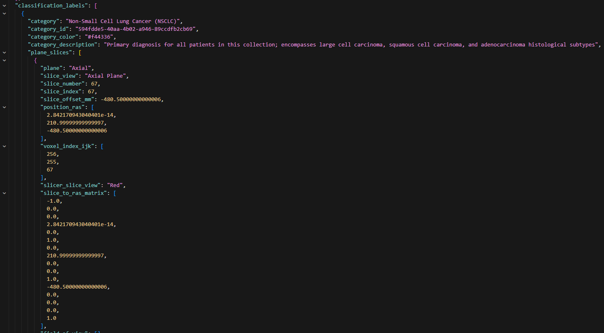

---

<h3 id="formal-export-package">10. Formal Export Package</h3>

**Description:** Export Annotations writes a subfolder containing `annotations.json` (classification, ROIs, label config, series metadata, segmentation metadata) plus up to three segmentation volume files when segmentation exists.

**User Value:** One export action produces a complete, pipeline-ready dataset artifact.

**Typical Use Case:** After annotating a case, the user exports to a shared drive; the ML team receives JSON + NIfTI without manual file assembly.

**Formal Export Package Example:** The screenshot below shows the contents of a formal export package produced by the panel. The export includes `annotations.json` (containing classification, ROIs, label configuration, and series metadata) and up to three segmentation NIfTI volume files. This provides a complete, standardized data bundle for downstream machine learning or analysis workflows.

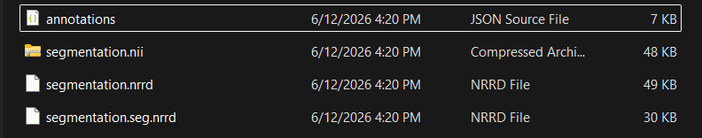

---

<h3 id="import-and-resume">11. Import and Resume</h3>

**Description:** Import Annotations accepts export folders, standalone `annotations.json`, or segmentation volumes alone. Restores classification, ROIs, and segmentation. Handles configuration conflicts with an explicit user choice.

**User Value:** Work is never trapped in a single Slicer session; projects can be handed off, reviewed, and continued.

**Typical Use Case:** Annotator A exports a half-finished case; Annotator B imports it, reviews ROIs, completes segmentation, and re-exports.

**Import and Resume Example:** The screenshot below demonstrates importing an existing annotations package into the panel. All previously saved classifications, ROIs, and segmentations are restored and editable, allowing seamless continuation of work across sessions or by different users.

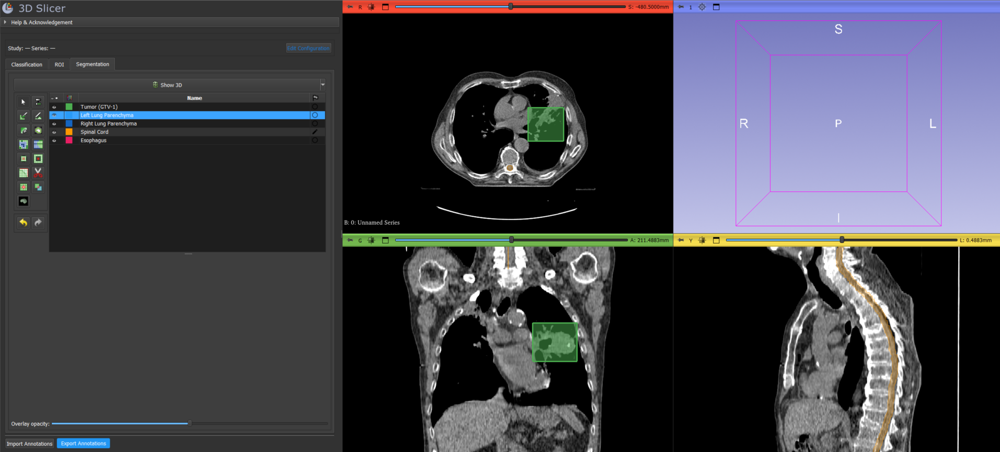

---

<h3 id="configuration-conflict-resolution">12. Configuration Conflict Resolution</h3>

**Description:** When imported label configuration differs from the active session, the user chooses **Import New Configuration** (replace all, auto-save as `Import-<name>` preset, return to config screen) or **Keep Current Configuration** (cancel import, no partial changes).

**User Value:** Prevents silent data corruption from mismatched label schemas.

**Typical Use Case:** Importing an external collaborator's export with a different label set — the lead decides whether to adopt their schema or reject the import.

---

<h3 id="edit-configuration-with-reconciliation">13. Edit Configuration with Reconciliation</h3>

**Description:** Users can return to the configuration screen from the annotation workspace. Label renames and color updates propagate to existing annotations; label removal or ROI drawing-tool changes trigger warnings and delete incompatible annotations.

**User Value:** Schema evolution is possible mid-project with clear consequences, not silent breakage.

**Typical Use Case:** A project adds a new segmentation class after 20 cases are annotated — existing annotations are preserved; only the new class is available for future work.

**Configuration Conflict Resolution Example:** The following screenshot illustrates the panel's behavior when an imported annotation package uses a different label configuration than the current session. The user is prompted to resolve the conflict by either importing the new configuration (which replaces the current settings and saves them as a preset), or by keeping the existing configuration and canceling the import. This prevents data mismatches and ensures intentional schema management.

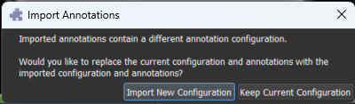

---

<h3 id="roi-only-partial-export">14. ROI-Only Partial Export</h3>

**Description:** The ROI tab offers a separate "Export ROIs to JSON" action that exports only the ROI list, independent of the full annotation package.

**User Value:** Quick sharing of ROI data with tools that only consume markup geometry.

**Typical Use Case:** Exporting lesion bounding boxes to a custom review spreadsheet without the full annotation package.

---

<h2 id="what-makes-this-different">4. What Makes This Different</h2>

| Capability | What this means for you |
|------------|-------------------------|
| **Tri-modal unity** | Classify slices, draw ROIs, and paint segmentations in one panel — one label setup, one export |
| **Preset-driven workflow** | Your label protocol is saved before annotation begins, so every session starts from the same schema |
| **Portable export packages** | Exports are self-contained folders you can share, archive, or hand off — not tied to a single Slicer scene file |
| **Multi-format segmentation export** | Choose NIfTI for ML tools, NRRD for research pipelines, or `.seg.nrrd` to reopen in Slicer with names and colors intact |
| **Multi-plane classification capture** | One Add action records your label across Axial, Coronal, and Sagittal views at once |
| **Works with or without a scan** | Set up labels and begin annotating before imaging arrives; the panel links to data automatically when it loads |
| **Configuration included in every export** | Anyone receiving your export knows exactly which labels were used — no separate legend file needed |
| **Rich scan metadata** | DICOM identifiers, spacing, and orientation travel with your annotations for reproducible downstream use |
| **Clear import choices** | When imported labels differ from yours, you decide whether to adopt the new schema or keep your own — nothing changes silently |
| **Focused segmentation tools** | Fourteen essential Segment Editor effects in a sensible order, without an overwhelming tool list |
| **ROI tool matched to each category** | Each ROI category uses the drawing tool you configured for it, so annotators cannot accidentally use the wrong shape type |
| **Older exports still open** | Annotations saved with earlier versions of the panel can still be imported |

---

<h2 id="user-workflows">5. User Workflows</h2>

### Primary workflow

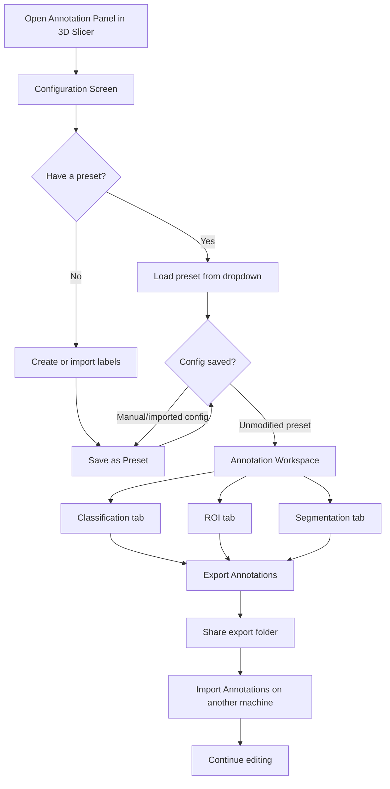

### First-time setup

1. Open 3D Slicer → select **Annotation Panel** from the Annotation category.
2. On the configuration screen, define classification labels, ROI categories (with drawing tools), and segment labels.
3. Click **Save as Preset** and name the configuration.
4. Click **Confirm & Start Annotation**.
5. (Optional) Load imaging data through Slicer's Data module — the panel links automatically.

### Preset reuse (returning user)

1. Open Annotation Panel.
2. Select a saved preset from the dropdown.
3. Click **Confirm & Start Annotation** immediately (no save required if preset is unmodified).
4. Annotate and export.

### Annotate without a scan

1. Complete configuration and confirm.
2. Use Classification tab to capture slice-level labels from current slice views.
3. Draw ROIs on slice views (markups work without underlying volume).
4. Paint segmentation on default reference geometry.
5. Export — folder name falls back to `AnnotationSession_YYYY_MM_DD`.

### Annotate with DICOM/NRRD

1. Load imaging data in Slicer first (or after configuration).
2. Panel auto-detects volume and displays study/series context.
3. Annotate across all three tabs.
4. Export — folder name derives from scan filename, volume name, or DICOM identifiers.

### Export and handoff

1. Click **Export Annotations** in the workspace action bar.
2. Select a parent directory.
3. Panel creates a subfolder with `annotations.json` and segmentation volumes (if applicable).
4. Share the subfolder with reviewers or ML pipelines.

### Import and resume

1. Click **Import Annotations**.
2. Select an export folder or `annotations.json`.
3. If label configuration matches → annotations load immediately.
4. If configuration differs → choose Import New Configuration or cancel.
5. Continue annotating and re-export.

### Edit configuration mid-project

1. Click **Edit Configuration** in the workspace header.
2. Warning dialog explains that annotation changes may occur.
3. Modify labels on the configuration screen.
4. On re-confirm: renamed labels update existing annotations; removed labels or changed ROI tools delete incompatible annotations (with explicit warnings).

### Team preset distribution

1. Project lead creates and saves a preset (or exports `docs/preset.json` as a template).
2. Team members use **Import from JSON** on the configuration screen or place JSON in the presets directory.
3. Everyone annotates with identical label schemas.

---

<h2 id="annotation-capabilities">6. Annotation Capabilities</h2>

### Classification

| Capability | Detail |
|------------|--------|
| Label selection | Color-coded checkable buttons from configured classification labels |
| Multi-plane capture | Single Add records Axial, Coronal, and Sagittal slice indexes simultaneously |
| Spatial metadata | RAS position, IJK coordinates, slice spacing, field of view, slice-to-RAS matrix per plane |
| Annotation table | Numbered rows with label name, three plane columns, color, and per-row delete |
| Bulk clear | Delete All removes all classification rows |
| Volume independence | Works with or without a linked scan |
| Timestamps | `created_at` recorded on each annotation (preserved on import, not updated on edit) |

### ROI

| Capability | Detail |
|------------|--------|
| **Bounding Box 2D** | `vtkMRMLMarkupsPlaneNode` — flat rectangular region on a slice plane |
| **Bounding Box** | `vtkMRMLMarkupsROINode` — 3D oriented bounding box |
| **Polygon Contour** | `vtkMRMLMarkupsClosedCurveNode` — closed polygon on a slice |
| **Freehand Contour** | `vtkMRMLMarkupsCurveNode` — open freehand curve |
| **Linear Measurement** | `vtkMRMLMarkupsLineNode` — distance measurement between two points |
| Category-tool binding | Selecting an ROI category activates its configured drawing tool automatically |
| Visibility | Per-ROI show/hide (session-only, not exported) and global hide/show all |
| Transform handles | Per-ROI move/rotate handle toggle |
| Extend mode | Add points to existing polygon, freehand, or line ROIs |
| Navigation | Clicking a table row selects the markup and jumps slice views to the ROI |
| Geometry export | Full RAS control points, radii, orientation, center; anatomical plane and slice index |
| Partial export | ROI-only JSON export from the ROI tab |

Tool availability is checked at runtime against the installed Slicer version; unsupported tools are disabled with an explanatory tooltip.

### Segmentation

| Capability | Detail |
|------------|--------|
| Segment classes | One MRML segment per configured segment label (name + color from config) |
| Curated effects | Threshold, Paint, Draw, Erase, Level tracing, Grow from seeds, Fill between slices, Margin, Hollow, Smoothing, Scissors, Islands, Logical operators, Mask volume |
| Overlay opacity | Slider controls segmentation display opacity (0–100%) |
| Volume-optional | Initializes with default 256³ reference geometry when no volume is loaded |
| Volume attach/detach | Binding or removing a volume preserves painted segment data |
| Modification tracking | Records effect name, parameters, and slice context per edit (volume-scoped effects tracked differently) |
| Statistics | Voxel count, volume (mm³), surface area, and oriented bounding box computed during annotation |
| Tab safety | Switching away from Segmentation tab deactivates the active effect |

---

<h2 id="data-management-features">7. Data Management Features</h2>

### Presets

- **Save as Preset** — writes label configuration JSON to a writable presets directory
- **Load from dropdown** — lists all saved presets (case-insensitive lookup)
- **Delete Preset** — removes preset file from disk with confirmation
- **Import from JSON** — loads external label configuration files (label definitions only, not annotations)
- **Storage locations** (first writable wins): module `presets/`, Slicer user data, `~/.AnnotationPanel/presets/`

### Configuration gating

| Config source | Continue without saving? |
|---------------|--------------------------|
| Loaded preset, unmodified | Yes |
| Manual edits | No — must Save as Preset |
| JSON import | No — must Save as Preset |
| Modified loaded/imported preset | No — must save again |

### Annotation persistence layers

| Layer | What persists | Where |
|-------|---------------|-------|
| In-session | Full annotation state including ROI visibility and modification events | Memory + Slicer MRML scene |
| Presets | Label configuration only | JSON files on disk |
| Formal export | Classification, ROIs, label config, series metadata, segmentation metadata + volume files | Export folder |

### Import reconciliation

- Segmentation segments mapped by `label_config_id` and `export_label_value`, with fallbacks for MRML id, unique name, and legacy index
- Classification mapped by `category_id`; legacy plain-string labels supported
- ROIs reconstructed from exported geometry with validation for missing reconstruction fields
- Import auto-preset: conflicting configuration saved as `Import-<derived-name>`

### Configuration change side effects

| Change | Effect on existing annotations |
|--------|-------------------------------|
| Switch preset | All annotations cleared |
| Rename label | Matching annotations updated |
| Change label color | Matching annotations updated |
| Remove label | Matching annotations deleted (with warning) |
| Change ROI drawing tool | ROIs for that category deleted (with warning) |

---

<h2 id="supported-output-formats">8. Supported Output Formats</h2>

| Format | Contents | Best for | Import support |
|--------|----------|----------|----------------|
| `annotations.json` | Classification, ROIs, label configuration, series metadata, segmentation metadata (schema 1.1.0) | Universal annotation package; ML metadata pipelines | Yes |
| `segmentation.nii.gz` | Multi-label labelmap (values 1, 2, 3… in config order) | PyTorch, TensorFlow, nnU-Net, MONAI | Yes |
| `segmentation.nrrd` | Plain labelmap (same voxels as NIfTI) | ITK, 3D Slicer tools preferring NRRD | Yes |
| `segmentation.seg.nrrd` | Slicer-native segmentation with names and colors | Slicer round-trip, preserving label semantics | Yes (preferred on import) |
| Preset JSON | Label configuration only (`classification_labels`, `roi_categories`, `segment_labels`) | Team standardization, config sharing | Yes (config screen import) |
| ROI-only JSON | Array of ROI dictionaries | Quick ROI geometry sharing | No (export only) |

**Import preference for segmentation files:** `segmentation.seg.nrrd` → `segmentation.nii.gz` → `segmentation.nrrd`

**Not exported:** ROI visibility state (session-only), MRML `label_to_segment_map` (rebuilt on import).

See [docs/export-format.md](docs/export-format.md) for folder naming rules, JSON key reference, and detailed import behavior.

---

## Appendix: Example Use Case — Spleen CT

The included sample preset ([docs/preset.json](docs/preset.json)) demonstrates a realistic clinical-research workflow:

- **Classification:** Normal, Enlarged, Abnormal spleen appearance
- **ROI:** Spleen (polygon), Lesion (3D bounding box), Infarct (polygon), Accessory Spleen (polygon), Artifact (linear measurement)
- **Segmentation:** Spleen parenchyma, Lesion, Infarct voxel classes

An annotator loads this preset, confirms, loads a CT series in Slicer, classifies representative slices, draws organ and lesion ROIs, paints segmentation masks, and exports a complete package for splenomegaly detection research or organ volumetry.
